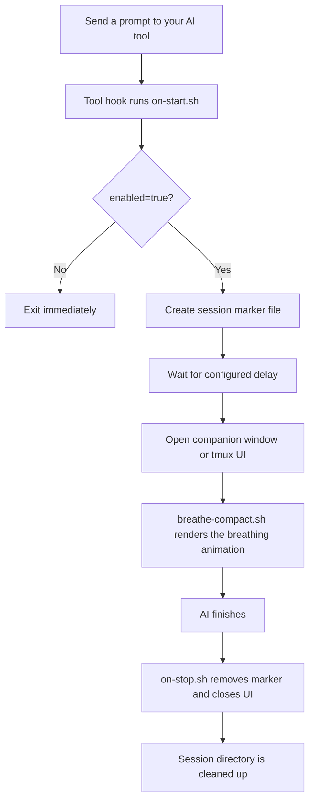

<p align="center">
  
</p>

<p align="center">
  <b>English</b> | <a href="docs/README.zh-TW.md">繁體中文</a> | <a href="docs/README.zh-CN.md">简体中文</a> | <a href="docs/README.ja.md">日本語</a>
</p>

<p align="center">
  
  
  
</p>

---

Every prompt you send to an AI coding assistant gives you 10–60+ seconds of idle time. **HushFlow** turns that wait into guided breathing exercises — auto-launches when the AI starts working, auto-dismisses when it's done.

**Transform AI wait time into a moment of zen.** 🧘‍♂️

Works with **Claude Code**, **Gemini CLI**, and **Codex CLI**. Runs on **macOS**, **Linux**, and **Windows**.

## ⚡ Quick Snapshot

<table>
  <tr>
    <td align="center" width="25%">
      <strong>🫁 Guided Breathing</strong><br />
      4 patterns: Coherent, Sigh, Box, and 4-7-8.
    </td>
    <td align="center" width="25%">
      <strong>🔌 Hook-Based</strong><br />
      Starts when your AI starts, stops when it finishes.
    </td>
    <td align="center" width="25%">
      <strong>🖥️ Flexible UI</strong><br />
      Companion window, tmux pane, popup, or inline mode.
    </td>
    <td align="center" width="25%">
      <strong>🎨 Pro Graphics</strong><br />
      6 sub-pixel animations with 5-level color gradients.
    </td>
  </tr>
</table>

## 📺 Demo

<p align="center">
  
</p>

## ✨ Features

- 🧘 **4 breathing exercises** — Coherent, Physiological Sigh, Box, 4-7-8
- 🎭 **6 animation styles** — Constellation, Ripple, Wave, Orbit, Helix, Rain
- 🌈 **8+ color themes** — Teal, Twilight, Amber + community themes (Catppuccin, Dracula, Nord, Solarized, Gruvbox)
- 📊 **Session statistics** — Track cycles, mindful time, streaks with `hushflow stats`
- 🔄 **Universal CLI wrapper** — `hushflow wrap -- <any-command>` for breathing during any wait
- 🔔 **Sound integration** — Optional chime sounds at breath transitions
- 🚀 **Non-blocking** — Runs in background/separate window; zero impact on AI tool output.
- 📉 **Pro Graphics** — High-performance Bash engine using SIN64 trig lookups for 10fps no-flicker rendering.
- 🔌 **Plugin API** — Support for custom animations via `~/.hushflow/plugins/`.
- 🤖 **Auto-launch / auto-dismiss** — Appears after configurable delay, closes when AI finishes.
- 💻 **Cross-platform** — Ghostty, Terminal.app, iTerm2, GNOME Terminal, xterm, Windows Terminal.

## 🚀 Quick Start

### 📦 Recommended: One-line install

```bash
curl -fsSL https://raw.githubusercontent.com/cry8a8y/HushFlow/main/install-remote.sh | sh
```

### 🛠️ With npx

```bash
npx hushflow install
```

### 📖 Manually

```bash
git clone https://github.com/cry8a8y/HushFlow.git
cd HushFlow
./install.sh
```

> [!NOTE]
> Requires `jq` for JSON configuration management.

### 🪟 Windows

```powershell
git clone https://github.com/cry8a8y/HushFlow.git
cd HushFlow
.\install.ps1
```

## 🧠 How It Works



## 🛠️ Supported AI Tools

| Tool | 🟢 Start Hook | 🔴 Stop Hook | Status |
|------|-----------|-----------|--------|
| **Claude Code** | `UserPromptSubmit` | `Stop` | ✅ Full support |
| **Gemini CLI** | `BeforeAgent` | `AfterAgent` | ✅ Full support |
| **Codex CLI** | `SessionStart` | `Stop` | ⏳ Session-level |

Install for a specific tool:

```bash
hushflow install --target gemini
```

## ⚙️ Configuration

Settings are stored per-tool at `~/.<tool>/hushflow/config`:

```ini
enabled=true
exercise=0
delay=5
theme=teal
animation=constellation
```

### ⌨️ CLI Commands

```bash
# Set exercise
hushflow config hrv            # Coherent Breathing
hushflow config sigh           # Physiological Sigh
hushflow config box            # Box Breathing
hushflow config 478            # 4-7-8 Breathing

# Set theme
hushflow theme twilight        # Soft purple
hushflow theme catppuccin-mocha # Community theme
hushflow theme list            # List all available themes

# Set animation
hushflow animation orbit       # Orbiting comets

# Sound
hushflow sound on              # Enable breath transition chimes
hushflow sound off             # Disable sounds

# Stats
hushflow stats                 # View sessions, streaks, and mindful time

# Universal wrapper
hushflow wrap -- npm install   # Breathe while any command runs

# Diagnostics
hushflow doctor                # Check installation & environment
```

> [!TIP]
> In Claude Code, you can also use the `/hushflow` slash command for interactive settings.

## 🛠️ Advanced Customization

### 🧩 Plugin API (Experimental)

Create custom animations by placing scripts in `~/.hushflow/plugins/`. Each plugin defines a `render_<name>()` function that appends ANSI escape codes to the `$frame` variable.

```bash
# Install the example plugin
mkdir -p ~/.hushflow/plugins
cp plugins/example-pulse.sh ~/.hushflow/plugins/pulse.sh
hushflow animation pulse
```

See the [Plugin API documentation](docs/PLUGIN-API.md) for available variables, trig tables, color palette, and performance tips.

### 🌐 Environment Variables

| Variable | Default | Description |
|----------|---------|-------------|
| `HUSHFLOW_UI_MODE` | `window` | `window`, `tmux-pane`, `tmux-popup`, `inline`, or `off` |
| `HUSHFLOW_DELAY_SECONDS` | config `delay` | Override the startup delay |
| `HUSHFLOW_COLS` | auto-detect | Override terminal width (columns) |
| `HUSHFLOW_ROWS` | auto-detect | Override terminal height (rows) |
| `HUSHFLOW_TERMINAL` | auto-detect | Force terminal type (e.g. `ghostty`, `iterm`, `xterm`) |
| `HUSHFLOW_PLUGIN_DIR` | `~/.hushflow/plugins` | Custom plugin directory |
| `HUSHFLOW_DEBUG` | off | Set to `1` to enable debug logging to `/tmp/hushflow-debug.log` |

## 🔍 Troubleshooting

If animations don't appear as expected, run the built-in diagnostic tool:

```bash
hushflow doctor
```

## 🗑️ Uninstall

```bash
hushflow uninstall
```

## 💖 Acknowledgments

HushFlow is derived from [Mindful-Claude](https://github.com/halluton/Mindful-Claude) by Halluton, licensed under the MIT License. See [THIRD-PARTY-NOTICES](THIRD-PARTY-NOTICES) for the original license.

## 📄 License

MIT. See [LICENSE](LICENSE) for details.
