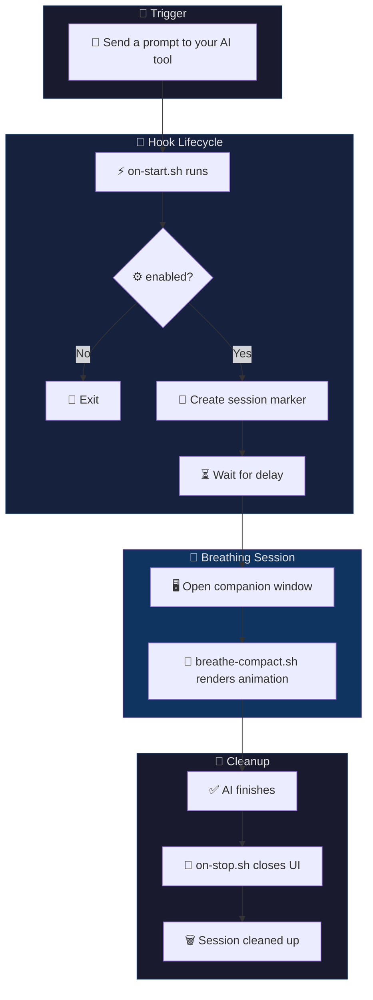

<p align="center">
  
</p>

<p align="center">
  <b>English</b> | <a href="docs/README.zh-TW.md">繁體中文</a> | <a href="docs/README.zh-CN.md">简体中文</a> | <a href="docs/README.ja.md">日本語</a>
</p>

<p align="center">
  <a href="https://github.com/cry8a8y/HushFlow/stargazers"></a>
  &nbsp;
  
  
</p>

---

A breathing layer for AI-powered terminals. Turns every wait into a calm ritual — across tools, across platforms, automatically.

**Claude Code** and **Gemini CLI** are fully supported with per-prompt hooks. **Codex CLI** works at session level.

## 🚀 Install in 60 Seconds

```bash
curl -fsSL https://raw.githubusercontent.com/cry8a8y/HushFlow/main/install-remote.sh | sh
```

<details>
<summary>Other install methods</summary>

**npx:**

```bash
npx hushflow install
```

**Manual:**

```bash
git clone https://github.com/cry8a8y/HushFlow.git
cd HushFlow
./install.sh
```

**Windows (PowerShell):**

```powershell
git clone https://github.com/cry8a8y/HushFlow.git
cd HushFlow
.\install.ps1
```

</details>

**What the installer does:**
1. Copies HushFlow to `~/.hushflow/`
2. Registers start/stop hooks in your AI tool's config
3. Creates a default config at `~/.<tool>/hushflow/config`

**Verify it works:**

```bash
hushflow doctor        # Check installation & environment
```

Then send any prompt to your AI tool and wait 5 seconds — a breathing window will appear.

### 📋 Dependencies

| Type | Package | Platform | Purpose |
|------|---------|----------|---------|
| **Core** | `bash` 4.0+ | All | Shell runtime |
| **Core** | `jq` | All | Config & theme parsing |
| **macOS** | `osascript` | macOS | Window positioning (built-in) |
| **Linux** | `xdotool` | Linux (X11) | Window focus & geometry |
| **Optional** | `tmux` | Any | tmux-pane / tmux-popup UI mode |
| **Optional** | `ffplay` / `mpv` / `afplay` | Any | Sound playback |

## 📺 What You See

<br/>
<p align="center">
  
</p>
<br/>

HushFlow adapts to your workflow with 4 UI modes:

| Mode | Best for | How to enable |
|------|----------|---------------|
| **Window** | Default — opens a companion terminal | `HUSHFLOW_UI_MODE=window` |
| **tmux pane** | tmux users — splits a pane | `HUSHFLOW_UI_MODE=tmux-pane` |
| **tmux popup** | tmux 3.2+ — floating overlay | `HUSHFLOW_UI_MODE=tmux-popup` |
| **Inline** | Minimal — renders in current terminal | `HUSHFLOW_UI_MODE=inline` |

## ✨ What Makes It Work

- **Shows up on its own** — Appears after a configurable delay, disappears when AI finishes. No manual triggers.
- **Never steals focus** — Runs in a separate window or tmux pane. Your terminal stays yours.
- **Works with your tools** — Claude Code, Gemini CLI, Codex CLI. One install covers all.
- **Runs everywhere** — macOS, Linux, Windows. Ghostty, iTerm2, Terminal.app, GNOME Terminal, xterm, Windows Terminal.
- **4 breathing patterns** — Coherent, Physiological Sigh, Box, 4-7-8. Pick your rhythm, HushFlow remembers it.
- **6 animations, 8+ themes** — From Constellation to Rain, from Teal to Dracula. Customize later, or never.

## 🛠️ Supported AI Tools

| Tool | 🟢 Start Hook | 🔴 Stop Hook | Status |
|------|-----------|-----------|--------|
| **Claude Code** | `UserPromptSubmit` | `Stop` | ✅ Full support |
| **Gemini CLI** | `BeforeAgent` | `AfterAgent` | ✅ Full support |
| **Codex CLI** | `SessionStart` | `Stop` | ⏳ Session-level |

```bash
hushflow install --target gemini   # Install for a specific tool
```

## ⌨️ Commands

```bash
# Breathing exercise
hushflow config hrv            # Coherent Breathing
hushflow config sigh           # Physiological Sigh
hushflow config box            # Box Breathing
hushflow config 478            # 4-7-8 Breathing

# Theme & animation
hushflow theme twilight        # Soft purple
hushflow theme list            # List all available themes
hushflow animation orbit       # Orbiting comets

# Sound, stats & wrapper
hushflow sound on              # Enable breath transition chimes
hushflow stats                 # View sessions, streaks, mindful time
hushflow wrap -- npm install   # Breathe while any command runs

# Diagnostics
hushflow doctor                # Check installation & environment
```

> [!TIP]
> In Claude Code, you can also use the `/hushflow` slash command for interactive settings.

## 🧠 How It Works



### ⚡ Under the Hood

| Metric | Value | Notes |
|--------|-------|-------|
| **Render** | 10 fps | Double-buffered, single `printf` per frame |
| **CPU** | < 2% | Trig lookup tables, no `bc`/`awk` in render loop |
| **Memory** | ~3 MB RSS | Pure Bash, no background daemons |
| **Startup** | < 50 ms | No interpreter boot, just `bash` |
| **Dependencies** | 0 in render path | `jq` only at config load |

## 📚 Advanced Docs

| Topic | Link |
|-------|------|
| **Community Themes** | 5 themes (Catppuccin, Dracula, Nord, Solarized, Gruvbox) + [create your own](CONTRIBUTING.md) |
| **Plugin API** | Custom animations — [docs/PLUGIN-API.md](docs/PLUGIN-API.md) |
| **Environment Variables** | `HUSHFLOW_UI_MODE`, `HUSHFLOW_DEBUG`, etc. — [full list](docs/ENVIRONMENT.md) |
| **Troubleshooting** | `hushflow doctor` or [docs/TROUBLESHOOTING.md](docs/TROUBLESHOOTING.md) |

## 🤝 Contributing

Contributions welcome! Whether it's a new theme, animation plugin, bug fix, or translation — check out [CONTRIBUTING.md](CONTRIBUTING.md) to get started.

If HushFlow helps you stay calm while coding, consider giving it a ⭐ — it helps others find the project.

## 💖 Acknowledgments

HushFlow is derived from [Mindful-Claude](https://github.com/halluton/Mindful-Claude) by Halluton, licensed under the MIT License. See [THIRD-PARTY-NOTICES](THIRD-PARTY-NOTICES) for the original license.

## 📄 License

MIT. See [LICENSE](LICENSE) for details.
