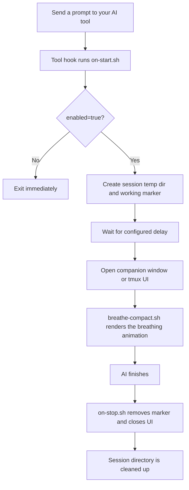

<p align="center">
  
</p>

<p align="center">
  
  
  
</p>

<p align="center">
  <b>English</b> | <a href="docs/README.zh-TW.md">繁體中文</a> | <a href="docs/README.zh-CN.md">简体中文</a> | <a href="docs/README.ja.md">日本語</a>
</p>

<p align="center">
  
  
  
</p>

---

Every prompt you send to an AI coding assistant gives you 10–60+ seconds of idle time. HushFlow turns that wait into guided breathing exercises — auto-launches when the AI starts working, auto-dismisses when it's done.

**Transform AI wait time into a moment of zen.**

Works with **Claude Code**, **Gemini CLI**, and **Codex CLI**. Runs on **macOS**, **Linux**, and **Windows**.

## Quick Snapshot

<table>
  <tr>
    <td align="center" width="25%">
      <strong>🫁 Guided Breathing</strong><br />
      4 patterns: Coherent, Sigh, Box, and 4-7-8.
    </td>
    <td align="center" width="25%">
      <strong>🔌 Hook-Based</strong><br />
      Starts when your AI starts, stops when it finishes.
    </td>
    <td align="center" width="25%">
      <strong>🖥️ Flexible UI</strong><br />
      Companion window, tmux pane, popup, or inline mode.
    </td>
    <td align="center" width="25%">
      <strong>🎨 Pro Graphics</strong><br />
      6 sub-pixel animations with 5-level color gradients.
    </td>
  </tr>
</table>

## Demo

<p align="center">
  
</p>

## Features

- **4 breathing exercises** — Coherent, Physiological Sigh, Box, 4-7-8
- **6 animation styles** — Constellation, Ripple, Wave, Orbit, Helix, Rain
- **3 color themes** — Teal, Twilight, Amber
- **Non-blocking** — Runs in background/separate window; zero impact on AI tool output.
- **Pro Graphics** — High-performance Bash engine using SIN64 trig lookups for 10fps no-flicker rendering.
- **Plugin API** — Support for custom animations via `~/.hushflow/plugins/`.
- **Auto-launch / auto-dismiss** — Appears after configurable delay, closes when AI finishes.
- **Cross-platform** — Ghostty, Terminal.app, iTerm2, GNOME Terminal, xterm, Windows Terminal.

## Quick Start

### Recommended: One-line install

```bash
curl -fsSL https://raw.githubusercontent.com/cry8a8y/HushFlow/main/install-remote.sh | sh
```

### With npx

```bash
npx hushflow install
```

### Manually

```bash
git clone https://github.com/cry8a8y/HushFlow.git
cd HushFlow
./install.sh
```

Requires `jq` for JSON configuration management.

### Windows

```powershell
git clone https://github.com/cry8a8y/HushFlow.git
cd HushFlow
.\install.ps1
```

## Supported AI Tools

| Tool | Start Hook | Stop Hook | Status |
|------|-----------|-----------|--------|
| **Claude Code** | `UserPromptSubmit` | `Stop` | Full support |
| **Gemini CLI** | `BeforeAgent` | `AfterAgent` | Full support |
| **Codex CLI** | `SessionStart` | `Stop` | Session-level |

Install for a specific tool:

```bash
./install.sh --target claude
./install.sh --target gemini
./install.sh --target codex
```

## Configuration

Settings are stored per-tool at `~/.<tool>/hushflow/config`:

```
enabled=true
exercise=0
delay=5
theme=teal
animation=constellation
```

### Exercises

| # | Exercise | Pattern | Best For |
|---|----------|---------|----------|
| 0 | **Coherent Breathing** | 5.5s in / 5.5s out | Sustained HRV improvement |
| 1 | **Physiological Sigh** | Double inhale / long exhale | Quick calm-down |
| 2 | **Box Breathing** | 4s in / 4s hold / 4s out / 4s hold | Focus and concentration |
| 3 | **4-7-8 Breathing** | 4s in / 7s hold / 8s out | Deep relaxation |

### Themes

| Theme | Description |
|-------|-------------|
| `teal` | Ocean teal — calm, flowing (default) |
| `twilight` | Soft purple — evening meditation |
| `amber` | Warm sunset — cozy and grounding |

### Animations

| Animation | Description |
|-----------|-------------|
| `constellation` | Twinkling star field that expands with breath (default) |
| `ripple` | Concentric ripples radiating from center |
| `wave` | Flowing sine wave with gradient fill |
| `orbit` | Dual orbiting comets with trail effects |
| `helix` | DNA-style double helix with crossing highlights |
| `rain` | Gentle rainfall with splash and puddle effects |

### CLI Commands

```bash
# Exercises
hushflow config hrv            # Coherent Breathing
hushflow config sigh           # Physiological Sigh
hushflow config box            # Box Breathing
hushflow config 478            # 4-7-8 Breathing

# Themes
hushflow theme teal            # Ocean teal
hushflow theme twilight        # Soft purple
hushflow theme amber           # Warm sunset

# Animations
hushflow animation constellation  # Star field
hushflow animation ripple         # Concentric ripples
hushflow animation wave           # Sine wave
hushflow animation orbit          # Orbiting comets
hushflow animation helix          # Double helix
hushflow animation rain           # Rainfall
```

Or use the scripts directly:

```bash
./set-exercise.sh box
./set-exercise.sh theme twilight
./set-exercise.sh animation rain
```

### Slash Command

In Claude Code, type `/hushflow` to view and change settings interactively.

### Environment Variables

| Variable | Default | Description |
|----------|---------|-------------|
| `HUSHFLOW_UI_MODE` | `window` | `window`, `tmux-pane`, `tmux-popup`, `inline`, or `off` |
| `HUSHFLOW_DELAY_SECONDS` | config `delay` | Override the startup delay |
| `HUSHFLOW_TERMINAL` | auto-detect | Force a specific terminal emulator |
| `HUSHFLOW_DEBUG` | off | Set to `1` to enable debug logging to `/tmp/hushflow-debug.log` |

## UI Modes

| Mode | Description |
|------|-------------|
| `window` (default) | Opens a small companion window using the best available terminal |
| `tmux-pane` | Non-focused pane below current tmux session |
| `tmux-popup` | Centered tmux popup (tmux 3.2+) |
| `inline` | No window — background process only |
| `off` | Hooks active but no visual output |

## How It Works



## Uninstall

```bash
./install.sh --uninstall
```

Windows:

```powershell
.\install.ps1 -Uninstall
```

## Acknowledgments

HushFlow is derived from [Mindful-Claude](https://github.com/halluton/Mindful-Claude) by Halluton, licensed under the MIT License. See [THIRD-PARTY-NOTICES](THIRD-PARTY-NOTICES) for the original license.

## License

MIT. See [LICENSE](LICENSE) for details.
