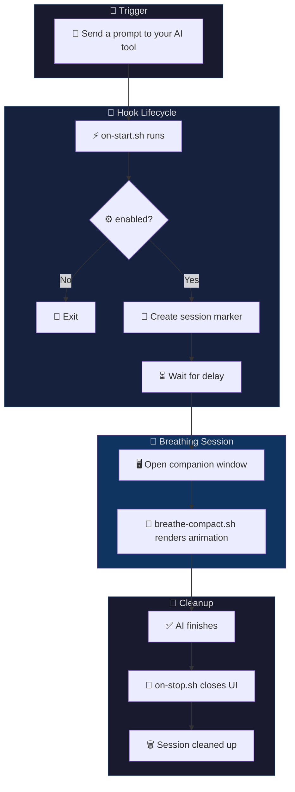

<p align="center">
  
</p>

<p align="center">
  <b>English</b> | <a href="docs/README.zh-TW.md">繁體中文</a> | <a href="docs/README.zh-CN.md">简体中文</a> | <a href="docs/README.ja.md">日本語</a>
</p>

<p align="center">
  <a href="https://github.com/cry8a8y/HushFlow/stargazers"></a>
  &nbsp;
  
  
  
  
</p>

---

You send a prompt. Your AI thinks for 30 seconds. You stare at a blinking cursor, check your phone, lose focus.

**What if that dead time made you calmer instead?**

**HushFlow** turns AI wait time into guided breathing exercises — auto-launches when the AI starts working, auto-dismisses when it's done. No setup per session, no manual timers. Just breathe.

Works with **Claude Code**, **Gemini CLI**, and **Codex CLI**. Runs on **macOS**, **Linux**, and **Windows**.

## ⚡ Quick Snapshot

- **🫁 Guided Breathing** — 4 patterns: Coherent, Physiological Sigh, Box, and 4-7-8
- **🔌 Hook-Based** — Starts when your AI starts, stops when it finishes
- **🖥️ Flexible UI** — Companion window, tmux pane, popup, or inline mode
- **🎨 Pro Graphics** — 6 sub-pixel animations with 5-level color gradients

### ⚡ Performance

| Metric | Value | Notes |
|--------|-------|-------|
| **Render** | 10 fps | Double-buffered, single `printf` per frame |
| **CPU** | < 2% | SIN64/COS32 lookup tables, no `bc`/`awk` in loop |
| **Memory** | ~3 MB RSS | Pure Bash, no background daemons |
| **Startup** | < 50 ms | No interpreter boot (Python/Node), just `bash` |
| **Dependencies** | 0 in render path | `jq` only at config load |

## 📺 Demo

<br/>
<p align="center">
  
</p>
<br/>

## ✨ Features

<table>
<tr>
<td width="50%">

### 🧘 Breathing
- **4 exercises** — Coherent, Physiological Sigh, Box, 4-7-8
- **Auto-launch** — Starts when AI thinks, stops when done
- **Configurable delay** — Set when breathing begins
- **Sound cues** — Optional chimes at breath transitions

</td>
<td width="50%">

### 🎨 Visuals
- **6 animations** — Constellation, Ripple, Wave, Orbit, Helix, Rain
- **8+ themes** — Teal, Twilight, Amber + community themes
- **10fps engine** — SIN64 trig lookups, zero flicker
- **Plugin API** — Custom animations via `~/.hushflow/plugins/`

</td>
</tr>
<tr>
<td width="50%">

### 🔌 Integration
- **3 AI tools** — Claude Code, Gemini CLI, Codex CLI
- **4 UI modes** — Window, tmux pane, popup, inline
- **Universal wrapper** — `hushflow wrap -- <any-command>`
- **Non-blocking** — Zero impact on AI tool output

</td>
<td width="50%">

### 📊 Tracking & More
- **Session stats** — Cycles, streaks, mindful time
- **Cross-platform** — macOS, Linux, Windows
- **6 terminals** — Ghostty, Terminal.app, iTerm2, GNOME, xterm, Windows Terminal
- **Self-diagnostics** — `hushflow doctor`

</td>
</tr>
</table>

## 🚀 Quick Start

### 📦 Recommended: One-line install

```bash
curl -fsSL https://raw.githubusercontent.com/cry8a8y/HushFlow/main/install-remote.sh | sh
```

### 🛠️ With npx

```bash
npx hushflow install
```

### 📖 Manually

```bash
git clone https://github.com/cry8a8y/HushFlow.git
cd HushFlow
./install.sh
```

### 📋 Dependencies

| Type | Package | Platform | Purpose |
|------|---------|----------|---------|
| **Core** | `bash` 4.0+ | All | Shell runtime |
| **Core** | `jq` | All | Config & theme parsing |
| **macOS** | `osascript` | macOS | Window positioning (built-in) |
| **Linux** | `xdotool` | Linux (X11) | Window focus & geometry |
| **Optional** | `tmux` | Any | tmux-pane / tmux-popup UI mode |
| **Optional** | `ffplay` / `mpv` / `afplay` | Any | Sound playback |

### 🪟 Windows

```powershell
git clone https://github.com/cry8a8y/HushFlow.git
cd HushFlow
.\install.ps1
```

## 🧠 How It Works



## 🛠️ Supported AI Tools

| Tool | 🟢 Start Hook | 🔴 Stop Hook | Status |
|------|-----------|-----------|--------|
| **Claude Code** | `UserPromptSubmit` | `Stop` | ✅ Full support |
| **Gemini CLI** | `BeforeAgent` | `AfterAgent` | ✅ Full support |
| **Codex CLI** | `SessionStart` | `Stop` | ⏳ Session-level |

Install for a specific tool:

```bash
hushflow install --target gemini
```

## ⚙️ Configuration

Settings are stored per-tool at `~/.<tool>/hushflow/config`:

```ini
enabled=true
exercise=0
delay=5
theme=teal
animation=constellation
sound=false
```

### ⌨️ CLI Commands

```bash
# Set exercise
hushflow config hrv            # Coherent Breathing
hushflow config sigh           # Physiological Sigh
hushflow config box            # Box Breathing
hushflow config 478            # 4-7-8 Breathing

# Set theme
hushflow theme twilight        # Soft purple
hushflow theme catppuccin-mocha # Community theme
hushflow theme list            # List all available themes

# Set animation
hushflow animation orbit       # Orbiting comets

# Sound
hushflow sound on              # Enable breath transition chimes
hushflow sound off             # Disable sounds

# Stats
hushflow stats                 # View sessions, streaks, and mindful time

# Universal wrapper
hushflow wrap -- npm install   # Breathe while any command runs

# Diagnostics
hushflow doctor                # Check installation & environment
```

> [!TIP]
> In Claude Code, you can also use the `/hushflow` slash command for interactive settings.

## 🛠️ Advanced Customization

### 🎨 Community Themes

HushFlow ships with 5 community themes: **Catppuccin Mocha**, **Dracula**, **Nord**, **Solarized Dark**, and **Gruvbox**.

```bash
hushflow theme catppuccin-mocha
hushflow theme list              # See all available themes
```

Create your own theme as a JSON file in `~/.hushflow/themes/`:

```json
{
  "name": "my-theme",
  "author": "your-name",
  "colors": {
    "primary": "R;G;B",
    "secondary": "R;G;B",
    "mid": "R;G;B",
    "mid_dim": "R;G;B",
    "dim": "R;G;B"
  }
}
```

See [CONTRIBUTING.md](CONTRIBUTING.md) for theme contribution guidelines.

### 🧩 Plugin API (Experimental)

Create custom animations by placing scripts in `~/.hushflow/plugins/`. Each plugin defines a `render_<name>()` function that appends ANSI escape codes to the `$frame` variable.

```bash
# Install the example plugin
mkdir -p ~/.hushflow/plugins
cp plugins/example-pulse.sh ~/.hushflow/plugins/pulse.sh
hushflow animation pulse
```

See the [Plugin API documentation](docs/PLUGIN-API.md) for available variables, trig tables, color palette, and performance tips.

### 🌐 Environment Variables

| Variable | Default | Description |
|----------|---------|-------------|
| `HUSHFLOW_UI_MODE` | `window` | `window`, `tmux-pane`, `tmux-popup`, `inline`, or `off` |
| `HUSHFLOW_DELAY_SECONDS` | config `delay` | Override the startup delay |
| `HUSHFLOW_COLS` | auto-detect | Override terminal width (columns) |
| `HUSHFLOW_ROWS` | auto-detect | Override terminal height (rows) |
| `HUSHFLOW_TERMINAL` | auto-detect | Force terminal type (e.g. `ghostty`, `iterm`, `xterm`) |
| `HUSHFLOW_PLUGIN_DIR` | `~/.hushflow/plugins` | Custom plugin directory |
| `HUSHFLOW_DEBUG` | off | Set to `1` to enable debug logging to `/tmp/hushflow-debug.log` |

## 🔍 Troubleshooting

If animations don't appear as expected, run the built-in diagnostic tool:

```bash
hushflow doctor
```

## 🗑️ Uninstall

```bash
hushflow uninstall
```

## 🤝 Contributing

Contributions welcome! Whether it's a new theme, animation plugin, bug fix, or translation — check out [CONTRIBUTING.md](CONTRIBUTING.md) to get started.

If HushFlow helps you stay calm while coding, consider giving it a ⭐ — it helps others find the project.

## 💖 Acknowledgments

HushFlow is derived from [Mindful-Claude](https://github.com/halluton/Mindful-Claude) by Halluton, licensed under the MIT License. See [THIRD-PARTY-NOTICES](THIRD-PARTY-NOTICES) for the original license.

## 📄 License

MIT. See [LICENSE](LICENSE) for details.
