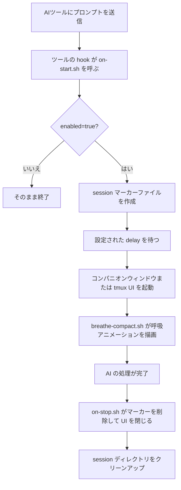

<p align="center">
  
</p>

<p align="center">
  <a href="../README.md">English</a> | <a href="README.zh-TW.md">繁體中文</a> | <a href="README.zh-CN.md">简体中文</a> | <b>日本語</b>
</p>

<p align="center">
  
  
  
</p>

---

AIコーディングアシスタントにプロンプトを送るたびに、10〜60秒以上の待ち時間が発生します。HushFlowはその待ち時間をガイド付き呼吸エクササイズに変えます — AIが作業を開始すると自動起動し、完了すると自動終了します。

**AIの待ち時間を、静寂のひとときに。**

**Claude Code**、**Gemini CLI**、**Codex CLI** に対応。**macOS**、**Linux**、**Windows** で動作します。

## ひと目でわかるポイント

<table>
  <tr>
    <td align="center" width="25%">
      <strong>🫁 ガイド付き呼吸</strong><br />
      4つのパターン：コヒーレント、ため息、ボックス、4-7-8。
    </td>
    <td align="center" width="25%">
      <strong>🔌 自動 Hook</strong><br />
      AIが動き始めると起動し、終わると自動で閉じます。
    </td>
    <td align="center" width="25%">
      <strong>🖥️ 柔軟な UI</strong><br />
      コンパニオンウィンドウ、tmux pane、popup、inline に対応。
    </td>
    <td align="center" width="25%">
      <strong>🎨 プロ品質のグラフィック</strong><br />
      6種類のサブピクセルアニメーション、5段階カラーグラデーション。
    </td>
  </tr>
</table>

## DEMO

<p align="center">
  
</p>

## 特徴

- **4つの呼吸法** — コヒーレント呼吸、生理的ため息、ボックス呼吸、4-7-8呼吸
- **6つのアニメーション** — 星座、波紋、波、軌道、らせん、雨
- **3つのカラーテーマ** — ティール、トワイライト、アンバー
- **作業を妨げない** — 別ウィンドウで動作。AIツールの出力に影響ゼロ。
- **プロ品質の描画** — SIN64三角関数テーブルを活用した高性能Bashエンジン。10fpsのちらつきなしレンダリング。
- **プラグインAPI** — `~/.hushflow/plugins/` でカスタムアニメーションをサポート。
- **自動起動 / 自動終了** — 設定可能な遅延後に表示、AI完了時に自動で閉じる。
- **クロスプラットフォーム** — Ghostty、Terminal.app、iTerm2、GNOME Terminal、xterm、Windows Terminal。

## クイックスタート

### おすすめ：ワンライナーインストール

```bash
curl -fsSL https://raw.githubusercontent.com/cry8a8y/HushFlow/main/install-remote.sh | sh
```

### npxを使う場合

```bash
npx hushflow install
```

### 手動インストール

```bash
git clone https://github.com/cry8a8y/HushFlow.git
cd HushFlow
./install.sh
```

JSON設定管理に `jq` が必要です。

### Windows

```powershell
git clone https://github.com/cry8a8y/HushFlow.git
cd HushFlow
.\install.ps1
```

## 仕組み



## 対応AIツール

| ツール | 開始 Hook | 停止 Hook | 状態 |
|--------|----------|----------|------|
| **Claude Code** | `UserPromptSubmit` | `Stop` | フルサポート |
| **Gemini CLI** | `BeforeAgent` | `AfterAgent` | フルサポート |
| **Codex CLI** | `SessionStart` | `Stop` | セッションレベル |

特定のツールにインストール：

```bash
hushflow install --target gemini
```

## 設定

設定ファイルは各ツールのディレクトリ `~/.<tool>/hushflow/config` に保存されます：

```
enabled=true
exercise=0
delay=5
theme=teal
animation=constellation
```

### CLIコマンド

```bash
# 呼吸エクササイズの設定
hushflow config hrv            # コヒーレント呼吸
hushflow config sigh           # 生理的ため息
hushflow config box            # ボックス呼吸
hushflow config 478            # 4-7-8呼吸

# テーマの設定
hushflow theme twilight        # トワイライトパープル

# アニメーションの設定
hushflow animation orbit       # 双彗星軌道
```

Claude Code では `/hushflow` コマンドでインタラクティブに設定できます。

## 高度なカスタマイズ

### プラグインAPI（実験的）

カスタムアニメーションスクリプトを `~/.hushflow/plugins/` に配置します。各プラグインは `render_<name>()` 関数を定義し、ANSIエスケープコードを `$frame` 変数に追加します。

```bash
# サンプルプラグインをインストール
mkdir -p ~/.hushflow/plugins
cp plugins/example-pulse.sh ~/.hushflow/plugins/pulse.sh
hushflow animation pulse
```

利用可能な変数、三角関数テーブル、カラー設定、パフォーマンスのコツは [Plugin API ドキュメント](PLUGIN-API.md) をご覧ください。

### 環境変数

| 変数 | デフォルト | 説明 |
|------|-----------|------|
| `HUSHFLOW_UI_MODE` | `window` | `window`、`tmux-pane`、`tmux-popup`、`inline`、`off` |
| `HUSHFLOW_DELAY_SECONDS` | 設定ファイルの `delay` | 起動遅延時間を上書き |
| `HUSHFLOW_DEBUG` | オフ | `1` に設定するとデバッグログを `/tmp/hushflow-debug.log` に出力 |

## トラブルシューティング

アニメーションが期待通りに表示されない場合は、内蔵の診断ツールを実行してください：

```bash
hushflow doctor
```

## アンインストール

```bash
hushflow uninstall
```

## 謝辞

HushFlowは [Mindful-Claude](https://github.com/halluton/Mindful-Claude)（作者：Halluton）から派生しており、MITライセンスの下で公開されています。詳細は [THIRD-PARTY-NOTICES](../THIRD-PARTY-NOTICES) をご覧ください。

## ライセンス

MIT。詳細は [LICENSE](../LICENSE) をご覧ください。
