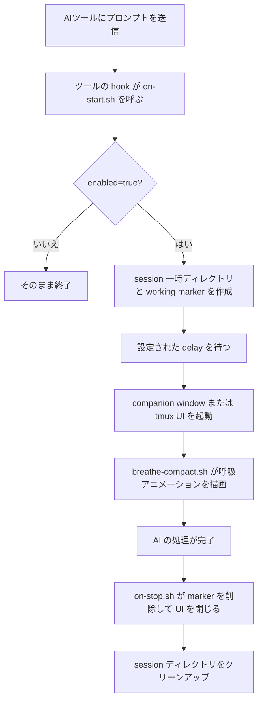

<p align="center">
  
</p>

<p align="center">
  <a href="../README.md">English</a> | <a href="README.zh-TW.md">繁體中文</a> | <a href="README.zh-CN.md">简体中文</a> | <b>日本語</b>
</p>

---

AIコーディングアシスタントにプロンプトを送るたびに、10〜60秒以上の待ち時間が発生します。HushFlowはその待ち時間をガイド付き呼吸エクササイズに変えます — AIが作業を開始すると自動起動し、完了すると自動終了します。

**Claude Code**、**Gemini CLI**、**Codex CLI** に対応。**macOS**、**Linux**、**Windows** で動作します。

## ひと目でわかるポイント

<table>
  <tr>
    <td align="center" width="25%">
      <strong>🫁 ガイド付き呼吸</strong><br />
      落ち着き、集中、切り替えに合わせた4つの呼吸法。
    </td>
    <td align="center" width="25%">
      <strong>🔌 自動 Hook</strong><br />
      AIが動き始めると起動し、終わると自動で閉じます。
    </td>
    <td align="center" width="25%">
      <strong>🖥️ 柔軟な UI</strong><br />
      companion window、tmux pane、popup、inline に対応。
    </td>
    <td align="center" width="25%">
      <strong>🎨 カスタマイズ可能</strong><br />
      呼吸法、テーマ、アニメーションを CLI で切り替え可能。
    </td>
  </tr>
</table>

## DEMO

<p align="center">
  
</p>

## 特徴

- **4つの呼吸法** — コヒーレント呼吸、生理的ため息、ボックス呼吸、4-7-8呼吸
- **6つのアニメーション** — 星座、波紋、波、軌道、らせん、雨
- **3つのカラーテーマ** — ティール、トワイライト、アンバー
- **自動起動 / 自動終了** — 設定可能な遅延後に表示、AI完了時に自動で閉じる
- **クロスプラットフォーム** — Ghostty、Terminal.app、iTerm2、GNOME Terminal、xterm、Windows Terminal
- **作業を妨げない** — 別の小さなウィンドウで開く。tmuxやインラインモードも対応

## クイックスタート

### ワンライナーインストール

```bash
curl -fsSL https://raw.githubusercontent.com/cry8a8y/HushFlow/main/install-remote.sh | sh
```

### npxを使う場合

```bash
npx hushflow install
```

### 手動インストール

```bash
git clone https://github.com/cry8a8y/HushFlow.git
cd HushFlow
./install.sh
```

インストーラーはインストール済みのAIツールを自動検出し、すべてのhookを設定します。`jq` が必要です。

### Windows

```powershell
git clone https://github.com/cry8a8y/HushFlow.git
cd HushFlow
.\install.ps1
```

## 対応AIツール

| ツール | 開始 Hook | 停止 Hook | 状態 |
|--------|----------|----------|------|
| **Claude Code** | `UserPromptSubmit` | `Stop` | フルサポート |
| **Gemini CLI** | `BeforeAgent` | `AfterAgent` | フルサポート |
| **Codex CLI** | `SessionStart` | `Stop` | セッションレベル |

特定のツールにインストール：

```bash
./install.sh --target claude
./install.sh --target gemini
./install.sh --target codex
```

## 設定

設定ファイルは各ツールのディレクトリ `~/.<tool>/hushflow/config` に保存されます：

```
enabled=true
exercise=0
delay=5
theme=teal
animation=constellation
```

### 呼吸エクササイズ

| # | エクササイズ | パターン | 最適な用途 |
|---|-------------|---------|-----------|
| 0 | **コヒーレント呼吸** | 吸う 5.5秒 / 吐く 5.5秒 | HRVの持続的改善 |
| 1 | **生理的ため息** | 二重吸気 / 長い呼気 | 素早くリラックス |
| 2 | **ボックス呼吸** | 吸う 4秒 / 止める 4秒 / 吐く 4秒 / 止める 4秒 | 集中力向上 |
| 3 | **4-7-8呼吸** | 吸う 4秒 / 止める 7秒 / 吐く 8秒 | 深いリラクゼーション |

### テーマ

| テーマ | 説明 |
|--------|------|
| `teal` | オーシャンティール — 穏やか、流動的（デフォルト） |
| `twilight` | トワイライトパープル — 夜の瞑想 |
| `amber` | アンバーウォーム — 温かく、落ち着く |

### アニメーション

| アニメーション | 説明 |
|--------------|------|
| `constellation` | 呼吸に合わせて広がる星空（デフォルト） |
| `ripple` | 中心から広がる同心円の波紋 |
| `wave` | グラデーション付きの正弦波 |
| `orbit` | 軌跡を描く二つの彗星 |
| `helix` | DNA風の二重らせんと交差ハイライト |
| `rain` | 水しぶきと水たまりのある穏やかな雨 |

### CLIコマンド

```bash
# 呼吸エクササイズ
hushflow config hrv            # コヒーレント呼吸
hushflow config sigh           # 生理的ため息
hushflow config box            # ボックス呼吸
hushflow config 478            # 4-7-8呼吸

# テーマ
hushflow theme teal            # オーシャンティール
hushflow theme twilight        # トワイライトパープル
hushflow theme amber           # アンバーウォーム

# アニメーション
hushflow animation constellation  # 星空
hushflow animation ripple         # 波紋
hushflow animation wave           # 波
hushflow animation orbit          # 軌道
hushflow animation helix          # らせん
hushflow animation rain           # 雨
```

スクリプトを直接使うこともできます：

```bash
./set-exercise.sh box
./set-exercise.sh theme twilight
./set-exercise.sh animation rain
```

### スラッシュコマンド

Claude Codeで `/hushflow` と入力すると、設定をインタラクティブに表示・変更できます。

### 環境変数

| 変数 | デフォルト | 説明 |
|------|-----------|------|
| `HUSHFLOW_UI_MODE` | `window` | `window`、`tmux-pane`、`tmux-popup`、`inline`、`off` |
| `HUSHFLOW_DELAY_SECONDS` | 設定ファイルの `delay` | 起動遅延時間を上書き |
| `HUSHFLOW_TERMINAL` | 自動検出 | ターミナルエミュレータを強制指定 |
| `HUSHFLOW_DEBUG` | オフ | `1` に設定するとデバッグログを `/tmp/hushflow-debug.log` に出力 |

## UIモード

| モード | 説明 |
|--------|------|
| `window`（デフォルト） | 最適なターミナルで小さなコンパニオンウィンドウを開く |
| `tmux-pane` | 現在のtmuxセッションの下に非フォーカスペインを開く |
| `tmux-popup` | tmuxの中央ポップアップ（tmux 3.2+が必要） |
| `inline` | ウィンドウなし — バックグラウンドプロセスのみ |
| `off` | Hookは動作するが視覚出力なし |

## 仕組み



## アンインストール

```bash
./install.sh --uninstall
```

Windows：

```powershell
.\install.ps1 -Uninstall
```

## 謝辞

HushFlowは [Mindful-Claude](https://github.com/halluton/Mindful-Claude)（作者：Halluton）から派生しており、MITライセンスの下で公開されています。詳細は [THIRD-PARTY-NOTICES](../THIRD-PARTY-NOTICES) をご覧ください。

## ライセンス

MIT。詳細は [LICENSE](../LICENSE) をご覧ください。
