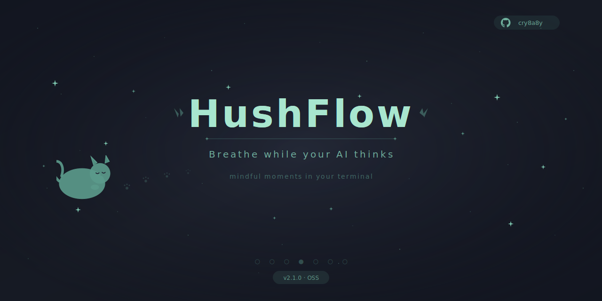
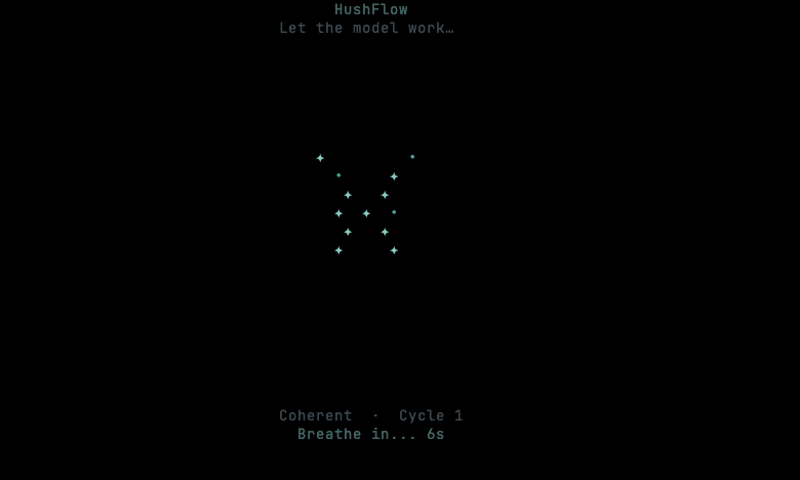

<p align="center">
  
</p>

<p align="center">
  <a href="../README.md">English</a> | <a href="README.zh-TW.md">繁體中文</a> | <b>简体中文</b> | <a href="README.ja.md">日本語</a>
</p>

<p align="center">
  <a href="https://github.com/cry8a8y/HushFlow/stargazers"></a>
  &nbsp;
  
  
</p>

---

为 AI 终端打造的呼吸层。把每一次等待，变成自动化的平静片刻 — 跨工具、跨平台。

**Claude Code** 和 **Gemini CLI** 完整支持逐次 prompt hook。**Codex CLI** 为 session 级别支持。

## 🚀 60 秒安装

```bash
curl -fsSL https://raw.githubusercontent.com/cry8a8y/HushFlow/main/install-remote.sh | sh
```

<details>
<summary>其他安装方式</summary>

**npx：**

```bash
npx hushflow install
```

**手动安装：**

```bash
git clone https://github.com/cry8a8y/HushFlow.git
cd HushFlow
./install.sh
```

**Windows (PowerShell)：**

```powershell
git clone https://github.com/cry8a8y/HushFlow.git
cd HushFlow
.\install.ps1
```

</details>

**安装程序做了什么：**
1. 将 HushFlow 复制到 `~/.hushflow/`
2. 在 AI 工具的配置文件中注册启动/停止 hook
3. 创建默认配置 `~/.<tool>/hushflow/config`

**验证安装：**

```bash
~/.hushflow/doctor.sh  # 检查安装状态与环境
```

然后发送任何 prompt 给 AI 工具，等待 5 秒 — 呼吸窗口就会出现。

### 📋 依赖

| 类型 | 包 | 平台 | 用途 |
|------|-----|------|------|
| **核心** | `bash` 4.0+ | 全部 | Shell 运行环境 |
| **核心** | `jq` | 全部 | 配置与主题解析 |
| **macOS** | `osascript` | macOS | 窗口定位（内置） |
| **Linux** | `xdotool` | Linux (X11) | 窗口焦点与坐标 |
| **可选** | `tmux` | 任意 | tmux-pane / tmux-popup 模式 |
| **可选** | `ffplay` / `mpv` / `afplay` | 任意 | 音效播放 |

## 📺 使用体验

<br/>
<p align="center">
  
</p>
<br/>

HushFlow 提供 4 种 UI 模式，适应不同工作流程：

| 模式 | 适用场景 | 启用方式 |
|------|---------|---------|
| **Window** | 默认 — 打开伴随终端窗口 | `HUSHFLOW_UI_MODE=window` |
| **tmux pane** | tmux 用户 — 分割窗格 | `HUSHFLOW_UI_MODE=tmux-pane` |
| **tmux popup** | tmux 3.2+ — 浮动覆盖层 | `HUSHFLOW_UI_MODE=tmux-popup` |
| **Inline** | 极简 — 在当前终端渲染 | `HUSHFLOW_UI_MODE=inline` |

## ✨ 为什么好用

- **自动出现** — 设定延迟后自动启动，AI 完成后自动消失。不需要手动触发。
- **不抢焦点** — 在独立窗口或 tmux 窗格中运行。你的终端完全不受影响。
- **支持你的工具** — Claude Code、Gemini CLI、Codex CLI。一次安装全部覆盖。
- **跨平台** — macOS、Linux、Windows。Ghostty、iTerm2、Terminal.app、GNOME Terminal、xterm、Windows Terminal。
- **4 种呼吸节奏** — 谐振、生理叹息、箱式、4-7-8。选好节奏，HushFlow 会记住。
- **6 种动画、8+ 主题** — 从星座到落雨，从海洋青到 Dracula。想调就调，不调也行。

## 🛠️ 支持的 AI 工具

| 工具 | 🟢 启动 Hook | 🔴 停止 Hook | 状态 |
|------|----------|----------|------|
| **Claude Code** | `UserPromptSubmit` | `Stop` | ✅ 完整支持 |
| **Gemini CLI** | `BeforeAgent` | `AfterAgent` | ✅ 完整支持 |
| **Codex CLI** | `SessionStart` | `Stop` | ⏳ Session 级别 |

```bash
hushflow install --target gemini   # 安装特定工具
```

## ⌨️ 命令

```bash
# 呼吸练习
hushflow config hrv            # 谐振呼吸
hushflow config sigh           # 生理叹息
hushflow config box            # 箱式呼吸
hushflow config 478            # 4-7-8 呼吸

# 主题与动画
hushflow theme twilight        # 暮光紫
hushflow theme list            # 列出所有可用主题
hushflow animation orbit       # 双彗星轨道

# 音效、统计与包装
hushflow sound on              # 启用呼吸转换提示音
hushflow stats                 # 查看使用统计与连续天数
hushflow wrap -- npm install   # 任何命令执行时都能呼吸

# 诊断工具
hushflow doctor                # 检查安装状态与环境
```

> [!TIP]
> 在 Claude Code 中，也可以使用 `/hushflow` 命令进行交互式设置。

## 🧠 工作原理

```
  发送 prompt 给 AI
        │
        ▼
  ┌─────────────┐    ┌──────────┐    ┌──────────────────┐    ┌──────────────┐
  │ on-start.sh │───▶│  延迟等待 │───▶│  打开伴随窗口     │───▶│   呼吸动画   │
  │  检查配置   │    │ (默认 5s) │    │                  │    │              │
  └─────────────┘    └──────────┘    └──────────────────┘    └──────┬───────┘
        │                                                          │
        │ 已禁用                                    AI 完成响应     │
        ▼                                                          ▼
     [退出]                                               ┌──────────────┐
                                                          │ on-stop.sh   │
                                                          │ 关闭并清理    │
                                                          └──────────────┘
```

### ⚡ 技术底层

| 指标 | 数值 | 说明 |
|------|------|------|
| **渲染** | 10 fps | 双缓冲，每帧单次 `printf` |
| **CPU** | < 2% | 三角函数查找表，循环内无 `bc`/`awk` |
| **内存** | ~3 MB RSS | 纯 Bash，无后台服务 |
| **启动** | < 50 ms | 无解释器启动，仅 `bash` |
| **依赖** | 渲染路径 0 个 | `jq` 仅在加载配置时使用 |

## 📚 进阶文档

| 主题 | 链接 |
|------|------|
| **社区主题** | 5 个主题（Catppuccin、Dracula、Nord、Solarized、Gruvbox）+ [自制主题](../CONTRIBUTING.md) |
| **插件 API** | 自定义动画 — [docs/PLUGIN-API.md](PLUGIN-API.md) |
| **环境变量** | `HUSHFLOW_UI_MODE`、`HUSHFLOW_DEBUG` 等 — [完整列表](ENVIRONMENT.md) |
| **疑难排解** | `hushflow doctor` 或 [docs/TROUBLESHOOTING.md](TROUBLESHOOTING.md) |

## 🤝 贡献

欢迎贡献！无论是新主题、动画插件、Bug 修复或翻译 — 请参阅 [CONTRIBUTING.md](../CONTRIBUTING.md) 开始。

如果 HushFlow 让你在写代码时更平静，欢迎给个 ⭐ — 帮助更多人发现这个项目。

## 💖 致谢

HushFlow 衍生自 [Mindful-Claude](https://github.com/halluton/Mindful-Claude)（作者：Halluton），基于 MIT 许可。详见 [THIRD-PARTY-NOTICES](../THIRD-PARTY-NOTICES)。

## 📄 许可证

MIT。详见 [LICENSE](../LICENSE)。
