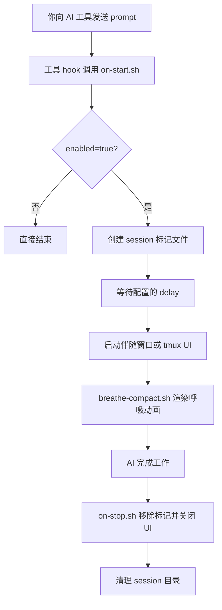

<p align="center">
  
</p>

<p align="center">
  <a href="../README.md">English</a> | <a href="README.zh-TW.md">繁體中文</a> | <b>简体中文</b> | <a href="README.ja.md">日本語</a>
</p>

<p align="center">
  
  
  
</p>

---

每次你向 AI 编程助手发送 prompt，都会有 10～60 秒以上的等待时间。HushFlow 把这段空白变成引导式呼吸练习 —— AI 开始工作时自动启动，完成时自动关闭。

**将 AI 的等待时间，转化为片刻的宁静。**

支持 **Claude Code**、**Gemini CLI** 和 **Codex CLI**。可在 **macOS**、**Linux** 和 **Windows** 上运行。

## 一眼看懂

<table>
  <tr>
    <td align="center" width="25%">
      <strong>🫁 引导呼吸</strong><br />
      4 种节奏：谐振、生理叹息、箱式与 4-7-8。
    </td>
    <td align="center" width="25%">
      <strong>🔌 自动 Hook</strong><br />
      AI 一开始工作就启动，结束就自动收起。
    </td>
    <td align="center" width="25%">
      <strong>🖥️ 弹性 UI</strong><br />
      可用伴随窗口、tmux pane、popup 或 inline。
    </td>
    <td align="center" width="25%">
      <strong>🎨 专业视觉</strong><br />
      6 种次像素动画，搭配 5 级色彩渐变。
    </td>
  </tr>
</table>

## DEMO

<p align="center">
  
</p>

## 功能特色

- **4 种呼吸练习** — 谐振呼吸、生理叹息、箱式呼吸、4-7-8 呼吸
- **6 种动画风格** — 星座、涟漪、波浪、轨道、螺旋、落雨
- **3 种色彩主题** — 海洋青、暮光紫、琥珀暖
- **不干扰工作** — 于独立窗口运行；对 AI 工具的输出零影响。
- **专业渲染** — 高性能 Bash 引擎，使用 SIN64 查找表实现 10fps 无闪烁动画。
- **插件支持 (Plugin API)** — 支持通过 `~/.hushflow/plugins/` 自定义动画。
- **自动启动 / 自动关闭** — 可设置延迟启动，AI 完成后自动消失。
- **跨平台** — Ghostty、Terminal.app、iTerm2、GNOME Terminal、xterm、Windows Terminal。

## 快速开始

### 推荐：一行安装

```bash
curl -fsSL https://raw.githubusercontent.com/cry8a8y/HushFlow/main/install-remote.sh | sh
```

### 使用 npx

```bash
npx hushflow install
```

### 手动安装

```bash
git clone https://github.com/cry8a8y/HushFlow.git
cd HushFlow
./install.sh
```

需要安装 `jq` 以管理 JSON 配置文件。

### Windows

```powershell
git clone https://github.com/cry8a8y/HushFlow.git
cd HushFlow
.\install.ps1
```

## 工作原理



## 支持的 AI 工具

| 工具 | 启动 Hook | 停止 Hook | 状态 |
|------|----------|----------|------|
| **Claude Code** | `UserPromptSubmit` | `Stop` | 完整支持 |
| **Gemini CLI** | `BeforeAgent` | `AfterAgent` | 完整支持 |
| **Codex CLI** | `SessionStart` | `Stop` | Session 级别 |

指定安装特定工具：

```bash
hushflow install --target gemini
```

## 配置

配置文件位于各工具目录下 `~/.<tool>/hushflow/config`：

```
enabled=true
exercise=0
delay=5
theme=teal
animation=constellation
```

### CLI 命令

```bash
# 设置呼吸练习
hushflow config hrv            # 谐振呼吸
hushflow config sigh           # 生理叹息
hushflow config box            # 箱式呼吸
hushflow config 478            # 4-7-8 呼吸

# 设置主题
hushflow theme twilight        # 暮光紫

# 设置动画
hushflow animation orbit       # 双彗星轨道
```

在 Claude Code 中，也可以使用 `/hushflow` 命令进行交互式设置。

## 进阶自定义

### 插件 API (实验性)

将自定义动画脚本放置于 `~/.hushflow/plugins/`。每个插件定义一个 `render_<name>()` 函数，将 ANSI 转义码附加至 `$frame` 变量中。

```bash
# 安装示例插件
mkdir -p ~/.hushflow/plugins
cp plugins/example-pulse.sh ~/.hushflow/plugins/pulse.sh
hushflow animation pulse
```

详见 [Plugin API 文档](PLUGIN-API.md)，包含可用变量、三角函数表、色彩配置与性能建议。

### 环境变量

| 变量 | 默认值 | 说明 |
|------|--------|------|
| `HUSHFLOW_UI_MODE` | `window` | `window`、`tmux-pane`、`tmux-popup`、`inline` 或 `off` |
| `HUSHFLOW_DELAY_SECONDS` | 配置文件中的 `delay` | 覆盖启动延迟时间 |
| `HUSHFLOW_DEBUG` | 关闭 | 设为 `1` 启用调试日志，输出至 `/tmp/hushflow-debug.log` |

## 疑难排解

如果动画未如预期出现，请运行内置的诊断工具：

```bash
hushflow doctor
```

## 卸载

```bash
hushflow uninstall
```

## 致谢

HushFlow 衍生自 [Mindful-Claude](https://github.com/halluton/Mindful-Claude)（作者：Halluton），基于 MIT 许可。详见 [THIRD-PARTY-NOTICES](../THIRD-PARTY-NOTICES)。

## 许可证

MIT。详见 [LICENSE](../LICENSE)。
