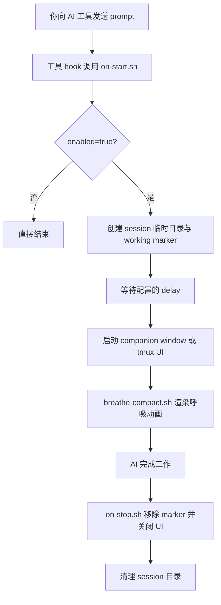

<p align="center">
  
</p>

<p align="center">
  <a href="../README.md">English</a> | <a href="README.zh-TW.md">繁體中文</a> | <b>简体中文</b> | <a href="README.ja.md">日本語</a>
</p>

---

每次你向 AI 编程助手发送 prompt，都会有 10～60 秒以上的等待时间。HushFlow 把这段空白变成引导式呼吸练习 —— AI 开始工作时自动启动，完成时自动关闭。

支持 **Claude Code**、**Gemini CLI** 和 **Codex CLI**。可在 **macOS**、**Linux** 和 **Windows** 上运行。

## 一眼看懂

<table>
  <tr>
    <td align="center" width="25%">
      <strong>🫁 引导呼吸</strong><br />
      四种节奏，对应放松、专注与稳定。
    </td>
    <td align="center" width="25%">
      <strong>🔌 自动 Hook</strong><br />
      AI 一开始工作就启动，结束就自动收起。
    </td>
    <td align="center" width="25%">
      <strong>🖥️ 弹性 UI</strong><br />
      支持 companion window、tmux pane、popup 与 inline。
    </td>
    <td align="center" width="25%">
      <strong>🎨 可自定义风格</strong><br />
      呼吸法、主题、动画都能用 CLI 快速切换。
    </td>
  </tr>
</table>

## DEMO

<p align="center">
  
</p>

## 功能特色

- **4 种呼吸练习** — 谐振呼吸、生理叹息、箱式呼吸、4-7-8 呼吸
- **6 种动画风格** — 星座、涟漪、波浪、轨道、螺旋、落雨
- **3 种色彩主题** — 青色、暮光、琥珀
- **自动启动 / 自动关闭** — 可设置延迟时间，AI 完成后自动消失
- **跨平台** — Ghostty、Terminal.app、iTerm2、GNOME Terminal、xterm、Windows Terminal
- **不干扰工作** — 在独立的小窗口中打开；也支持 tmux 和 inline 模式

## 快速开始

### 一行安装

```bash
curl -fsSL https://raw.githubusercontent.com/cry8a8y/HushFlow/main/install-remote.sh | sh
```

### 使用 npx

```bash
npx hushflow install
```

### 手动安装

```bash
git clone https://github.com/cry8a8y/HushFlow.git
cd HushFlow
./install.sh
```

安装程序会自动检测已安装的 AI 工具并配置 hooks。需要 `jq`。

### Windows

```powershell
git clone https://github.com/cry8a8y/HushFlow.git
cd HushFlow
.\install.ps1
```

## 支持的 AI 工具

| 工具 | 启动 Hook | 停止 Hook | 状态 |
|------|----------|----------|------|
| **Claude Code** | `UserPromptSubmit` | `Stop` | 完整支持 |
| **Gemini CLI** | `BeforeAgent` | `AfterAgent` | 完整支持 |
| **Codex CLI** | `SessionStart` | `Stop` | Session 级别 |

指定安装特定工具：

```bash
./install.sh --target claude
./install.sh --target gemini
./install.sh --target codex
```

## 配置

配置文件位于各工具目录下 `~/.<tool>/hushflow/config`：

```
enabled=true
exercise=0
delay=5
theme=teal
animation=constellation
```

### 呼吸练习

| # | 练习 | 节奏 | 适合场景 |
|---|------|------|----------|
| 0 | **谐振呼吸** | 吸 5.5 秒 / 呼 5.5 秒 | 持续提升心率变异性 |
| 1 | **生理叹息** | 双重吸气 / 长呼气 | 快速平静 |
| 2 | **箱式呼吸** | 吸 4 秒 / 屏 4 秒 / 呼 4 秒 / 屏 4 秒 | 专注力提升 |
| 3 | **4-7-8 呼吸** | 吸 4 秒 / 屏 7 秒 / 呼 8 秒 | 深度放松 |

### 主题

| 主题 | 说明 |
|------|------|
| `teal` | 海洋青 — 平静、流动（默认） |
| `twilight` | 暮光紫 — 夜间冥想 |
| `amber` | 琥珀暖 — 温暖、沉稳 |

### 动画

| 动画 | 说明 |
|------|------|
| `constellation` | 随呼吸扩张的闪烁星空（默认） |
| `ripple` | 从中心扩散的同心涟漪 |
| `wave` | 带有渐变填充的正弦波 |
| `orbit` | 双彗星轨道与拖尾效果 |
| `helix` | DNA 风格的双螺旋与交叉高亮 |
| `rain` | 轻柔落雨配水花与水洼 |

### CLI 命令

```bash
# 呼吸练习
hushflow config hrv            # 谐振呼吸
hushflow config sigh           # 生理叹息
hushflow config box            # 箱式呼吸
hushflow config 478            # 4-7-8 呼吸

# 主题
hushflow theme teal            # 海洋青
hushflow theme twilight        # 暮光紫
hushflow theme amber           # 琥珀暖

# 动画
hushflow animation constellation  # 星空
hushflow animation ripple         # 涟漪
hushflow animation wave           # 波浪
hushflow animation orbit          # 轨道
hushflow animation helix          # 螺旋
hushflow animation rain           # 落雨
```

也可以直接使用脚本：

```bash
./set-exercise.sh box
./set-exercise.sh theme twilight
./set-exercise.sh animation rain
```

### 斜杠命令

在 Claude Code 中输入 `/hushflow` 即可交互式查看和修改设置。

### 环境变量

| 变量 | 默认值 | 说明 |
|------|--------|------|
| `HUSHFLOW_UI_MODE` | `window` | `window`、`tmux-pane`、`tmux-popup`、`inline` 或 `off` |
| `HUSHFLOW_DELAY_SECONDS` | 配置文件中的 `delay` | 覆盖启动延迟时间 |
| `HUSHFLOW_TERMINAL` | 自动检测 | 强制指定终端模拟器 |
| `HUSHFLOW_DEBUG` | 关闭 | 设为 `1` 启用调试日志，输出至 `/tmp/hushflow-debug.log` |

## UI 模式

| 模式 | 说明 |
|------|------|
| `window`（默认） | 使用最佳可用终端打开小型伴随窗口 |
| `tmux-pane` | 在当前 tmux session 下方打开非聚焦面板 |
| `tmux-popup` | 居中 tmux 弹出窗口（需 tmux 3.2+） |
| `inline` | 无窗口 — 仅后台进程 |
| `off` | Hooks 仍运行但无视觉输出 |

## 工作原理



## 卸载

```bash
./install.sh --uninstall
```

Windows：

```powershell
.\install.ps1 -Uninstall
```

## 致谢

HushFlow 衍生自 [Mindful-Claude](https://github.com/halluton/Mindful-Claude)（作者：Halluton），基于 MIT 许可。详见 [THIRD-PARTY-NOTICES](../THIRD-PARTY-NOTICES)。

## 许可证

MIT。详见 [LICENSE](../LICENSE)。
