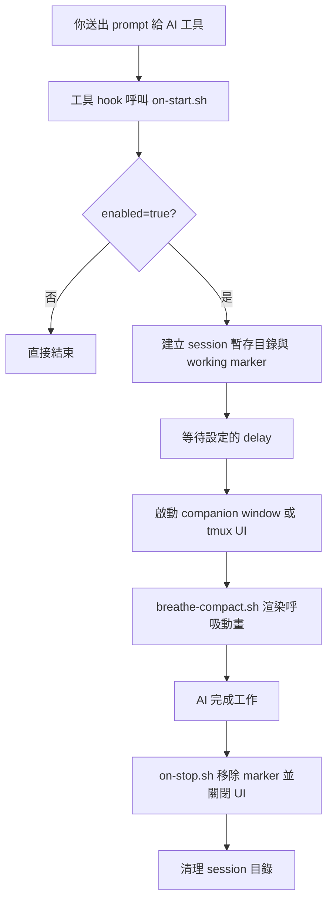

<p align="center">
  
</p>

<p align="center">
  <a href="../README.md">English</a> | <b>繁體中文</b> | <a href="README.zh-CN.md">简体中文</a> | <a href="README.ja.md">日本語</a>
</p>

---

每次你送出 prompt 給 AI 編程助手，都會有 10～60 秒以上的等待時間。HushFlow 把這段空白變成引導式呼吸練習 —— AI 開始工作時自動啟動，完成時自動關閉。

支援 **Claude Code**、**Gemini CLI** 和 **Codex CLI**。可在 **macOS**、**Linux** 和 **Windows** 上運行。

## 一眼看懂

<table>
  <tr>
    <td align="center" width="25%">
      <strong>🫁 引導呼吸</strong><br />
      四種節奏，對應放鬆、專注與穩定。
    </td>
    <td align="center" width="25%">
      <strong>🔌 自動 Hook</strong><br />
      AI 一開始工作就啟動，結束就自動收掉。
    </td>
    <td align="center" width="25%">
      <strong>🖥️ 彈性 UI</strong><br />
      可用 companion window、tmux pane、popup 或 inline。
    </td>
    <td align="center" width="25%">
      <strong>🎨 可自訂風格</strong><br />
      呼吸法、主題、動畫都能用 CLI 快速切換。
    </td>
  </tr>
</table>

## DEMO

<p align="center">
  
</p>

## 功能特色

- **4 種呼吸練習** — 諧振呼吸、生理嘆息、箱式呼吸、4-7-8 呼吸
- **6 種動畫風格** — 星座、漣漪、波浪、軌道、螺旋、落雨
- **3 種色彩主題** — 青色、暮光、琥珀
- **自動啟動 / 自動關閉** — 可設定延遲時間，AI 完成後自動消失
- **跨平台** — Ghostty、Terminal.app、iTerm2、GNOME Terminal、xterm、Windows Terminal
- **不干擾工作** — 在獨立的小視窗中開啟；也支援 tmux 和 inline 模式

## 快速開始

### 一行安裝

```bash
curl -fsSL https://raw.githubusercontent.com/cry8a8y/HushFlow/main/install-remote.sh | sh
```

### 使用 npx

```bash
npx hushflow install
```

### 手動安裝

```bash
git clone https://github.com/cry8a8y/HushFlow.git
cd HushFlow
./install.sh
```

安裝程式會自動偵測已安裝的 AI 工具並設定 hooks。需要 `jq`。

### Windows

```powershell
git clone https://github.com/cry8a8y/HushFlow.git
cd HushFlow
.\install.ps1
```

## 支援的 AI 工具

| 工具 | 啟動 Hook | 停止 Hook | 狀態 |
|------|----------|----------|------|
| **Claude Code** | `UserPromptSubmit` | `Stop` | 完整支援 |
| **Gemini CLI** | `BeforeAgent` | `AfterAgent` | 完整支援 |
| **Codex CLI** | `SessionStart` | `Stop` | Session 層級 |

指定安裝特定工具：

```bash
./install.sh --target claude
./install.sh --target gemini
./install.sh --target codex
```

## 設定

設定檔位於各工具目錄下 `~/.<tool>/hushflow/config`：

```
enabled=true
exercise=0
delay=5
theme=teal
animation=constellation
```

### 呼吸練習

| # | 練習 | 節奏 | 適合情境 |
|---|------|------|----------|
| 0 | **諧振呼吸** | 吸 5.5 秒 / 吐 5.5 秒 | 持續提升心率變異性 |
| 1 | **生理嘆息** | 雙重吸氣 / 長吐氣 | 快速平靜 |
| 2 | **箱式呼吸** | 吸 4 秒 / 屏 4 秒 / 吐 4 秒 / 屏 4 秒 | 專注力提升 |
| 3 | **4-7-8 呼吸** | 吸 4 秒 / 屏 7 秒 / 吐 8 秒 | 深度放鬆 |

### 主題

| 主題 | 說明 |
|------|------|
| `teal` | 海洋青 — 平靜、流動（預設） |
| `twilight` | 暮光紫 — 夜間冥想 |
| `amber` | 琥珀暖 — 溫暖、沉穩 |

### 動畫

| 動畫 | 說明 |
|------|------|
| `constellation` | 隨呼吸擴張的閃爍星空（預設） |
| `ripple` | 從中心擴散的同心漣漪 |
| `wave` | 帶有漸層填充的正弦波 |
| `orbit` | 雙彗星軌道與拖尾效果 |
| `helix` | DNA 風格的雙螺旋與交叉高亮 |
| `rain` | 輕柔落雨配水花與水窪 |

### CLI 指令

```bash
# 呼吸練習
hushflow config hrv            # 諧振呼吸
hushflow config sigh           # 生理嘆息
hushflow config box            # 箱式呼吸
hushflow config 478            # 4-7-8 呼吸

# 主題
hushflow theme teal            # 海洋青
hushflow theme twilight        # 暮光紫
hushflow theme amber           # 琥珀暖

# 動畫
hushflow animation constellation  # 星空
hushflow animation ripple         # 漣漪
hushflow animation wave           # 波浪
hushflow animation orbit          # 軌道
hushflow animation helix          # 螺旋
hushflow animation rain           # 落雨
```

也可以直接使用腳本：

```bash
./set-exercise.sh box
./set-exercise.sh theme twilight
./set-exercise.sh animation rain
```

### 斜線指令

在 Claude Code 中輸入 `/hushflow` 即可互動式查看和修改設定。

### 環境變數

| 變數 | 預設值 | 說明 |
|------|--------|------|
| `HUSHFLOW_UI_MODE` | `window` | `window`、`tmux-pane`、`tmux-popup`、`inline` 或 `off` |
| `HUSHFLOW_DELAY_SECONDS` | 設定檔中的 `delay` | 覆寫啟動延遲時間 |
| `HUSHFLOW_TERMINAL` | 自動偵測 | 強制指定終端模擬器 |
| `HUSHFLOW_DEBUG` | 關閉 | 設為 `1` 啟用除錯日誌，輸出至 `/tmp/hushflow-debug.log` |

## UI 模式

| 模式 | 說明 |
|------|------|
| `window`（預設） | 使用最佳可用終端開啟小型伴隨視窗 |
| `tmux-pane` | 在當前 tmux session 下方開啟非聚焦面板 |
| `tmux-popup` | 置中 tmux 彈出視窗（需 tmux 3.2+） |
| `inline` | 無視窗 — 僅背景程序 |
| `off` | Hooks 仍運作但無視覺輸出 |

## 運作原理



## 解除安裝

```bash
./install.sh --uninstall
```

Windows：

```powershell
.\install.ps1 -Uninstall
```

## 致謝

HushFlow 衍生自 [Mindful-Claude](https://github.com/halluton/Mindful-Claude)（作者：Halluton），基於 MIT 授權。詳見 [THIRD-PARTY-NOTICES](../THIRD-PARTY-NOTICES)。

## 授權

MIT。詳見 [LICENSE](../LICENSE)。
