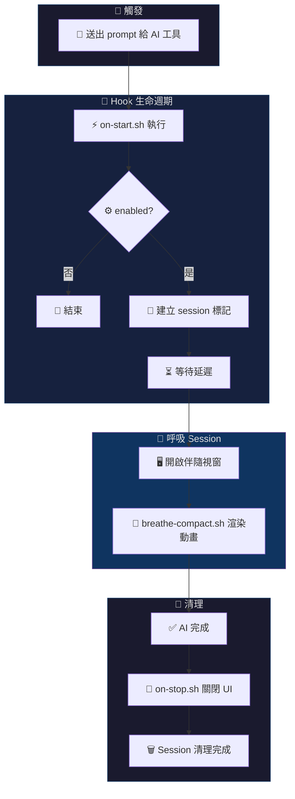

<p align="center">
  
</p>

<p align="center">
  <a href="../README.md">English</a> | <b>繁體中文</b> | <a href="README.zh-CN.md">简体中文</a> | <a href="README.ja.md">日本語</a>
</p>

<p align="center">
  <a href="https://github.com/cry8a8y/HushFlow/stargazers"></a>
  &nbsp;
  
  
</p>

---

AI 等待時間的正念呼吸引導。AI 開始工作時自動啟動，完成時自動關閉。

支援 **Claude Code** 和 **Gemini CLI**（完整的逐次 prompt hook）。**Codex CLI** 目前為 session 層級支援。

## 🚀 60 秒安裝

```bash
curl -fsSL https://raw.githubusercontent.com/cry8a8y/HushFlow/main/install-remote.sh | sh
```

<details>
<summary>其他安裝方式</summary>

**npx：**

```bash
npx hushflow install
```

**手動安裝：**

```bash
git clone https://github.com/cry8a8y/HushFlow.git
cd HushFlow
./install.sh
```

**Windows (PowerShell)：**

```powershell
git clone https://github.com/cry8a8y/HushFlow.git
cd HushFlow
.\install.ps1
```

</details>

**安裝程式會做什麼：**
1. 將 HushFlow 複製到 `~/.hushflow/`
2. 在 AI 工具的設定檔中註冊啟動/停止 hook
3. 建立預設設定檔 `~/.<tool>/hushflow/config`

**驗證安裝：**

```bash
hushflow doctor        # 檢查安裝狀態與環境
```

然後送出任何 prompt 給 AI 工具，等待 5 秒 — 呼吸視窗就會出現。

### 📋 依賴套件

| 類型 | 套件 | 平台 | 用途 |
|------|------|------|------|
| **核心** | `bash` 4.0+ | 全部 | Shell 執行環境 |
| **核心** | `jq` | 全部 | 設定檔與主題解析 |
| **macOS** | `osascript` | macOS | 視窗定位（內建） |
| **Linux** | `xdotool` | Linux (X11) | 視窗焦點與座標 |
| **可選** | `tmux` | 任意 | tmux-pane / tmux-popup 模式 |
| **可選** | `ffplay` / `mpv` / `afplay` | 任意 | 音效播放 |

## 📺 使用體驗

<br/>
<p align="center">
  
</p>
<br/>

HushFlow 提供 4 種 UI 模式，適應不同工作流程：

| 模式 | 適合場景 | 啟用方式 |
|------|---------|---------|
| **Window** | 預設 — 開啟伴隨終端視窗 | `HUSHFLOW_UI_MODE=window` |
| **tmux pane** | tmux 使用者 — 分割窗格 | `HUSHFLOW_UI_MODE=tmux-pane` |
| **tmux popup** | tmux 3.2+ — 浮動覆蓋層 | `HUSHFLOW_UI_MODE=tmux-popup` |
| **Inline** | 極簡 — 在當前終端渲染 | `HUSHFLOW_UI_MODE=inline` |

## ✨ 功能特色

<table>
<tr>
<td width="50%">

### 🧘 呼吸
- **4 種練習** — 諧振、生理嘆息、箱式、4-7-8
- **自動啟動** — AI 思考時開始，完成時結束
- **可設延遲** — 自訂啟動等待時間
- **音效提示** — 可選的呼吸轉換提示音

</td>
<td width="50%">

### 🎨 視覺
- **6 種動畫** — 星座、漣漪、波浪、軌道、螺旋、落雨
- **8+ 主題** — 海洋青、暮光紫、琥珀暖 + 社群主題
- **10fps 引擎** — SIN64 查找表，零閃爍
- **外掛 API** — 自訂動畫腳本

</td>
</tr>
<tr>
<td width="50%">

### 🔌 整合
- **3 個 AI 工具** — Claude Code、Gemini CLI、Codex CLI
- **4 種 UI 模式** — 視窗、tmux pane、popup、inline
- **通用包裝** — `hushflow wrap -- <任何指令>`
- **不干擾** — 對 AI 工具輸出零影響

</td>
<td width="50%">

### 📊 追蹤與更多
- **使用統計** — 呼吸次數、連續天數、正念時間
- **跨平台** — macOS、Linux、Windows
- **6 種終端** — Ghostty、Terminal.app、iTerm2、GNOME、xterm、Windows Terminal
- **自我診斷** — `hushflow doctor`

</td>
</tr>
</table>

### ⚡ 效能

| 指標 | 數值 | 說明 |
|------|------|------|
| **渲染** | 10 fps | 雙緩衝，每幀單次 `printf` |
| **CPU** | < 2% | SIN64/COS32 查找表，迴圈內無 `bc`/`awk` |
| **記憶體** | ~3 MB RSS | 純 Bash，無背景服務 |
| **啟動** | < 50 ms | 無直譯器啟動（Python/Node），僅 `bash` |
| **依賴** | 渲染路徑 0 個 | `jq` 僅在載入設定時使用 |

## 🛠️ 支援的 AI 工具

| 工具 | 🟢 啟動 Hook | 🔴 停止 Hook | 狀態 |
|------|----------|----------|------|
| **Claude Code** | `UserPromptSubmit` | `Stop` | ✅ 完整支援 |
| **Gemini CLI** | `BeforeAgent` | `AfterAgent` | ✅ 完整支援 |
| **Codex CLI** | `SessionStart` | `Stop` | ⏳ Session 層級 |

```bash
hushflow install --target gemini   # 安裝特定工具
```

## ⌨️ 指令

```bash
# 呼吸練習
hushflow config hrv            # 諧振呼吸
hushflow config sigh           # 生理嘆息
hushflow config box            # 箱式呼吸
hushflow config 478            # 4-7-8 呼吸

# 主題與動畫
hushflow theme twilight        # 暮光紫
hushflow theme list            # 列出所有可用主題
hushflow animation orbit       # 雙彗星軌道

# 音效、統計與包裝
hushflow sound on              # 啟用呼吸轉換提示音
hushflow stats                 # 查看使用統計與連續天數
hushflow wrap -- npm install   # 任何指令執行時都能呼吸

# 診斷工具
hushflow doctor                # 檢查安裝狀態與環境
```

> [!TIP]
> 在 Claude Code 中，也可以使用 `/hushflow` 指令進行互動式設定。

## 🧠 運作原理



## 📚 進階文件

| 主題 | 連結 |
|------|------|
| **社群主題** | 5 個主題（Catppuccin、Dracula、Nord、Solarized、Gruvbox）+ [自製主題](../CONTRIBUTING.md) |
| **外掛 API** | 自訂動畫 — [docs/PLUGIN-API.md](PLUGIN-API.md) |
| **環境變數** | `HUSHFLOW_UI_MODE`、`HUSHFLOW_DEBUG` 等 — [完整清單](ENVIRONMENT.md) |
| **疑難排解** | `hushflow doctor` 或 [docs/TROUBLESHOOTING.md](TROUBLESHOOTING.md) |

## 🤝 貢獻

歡迎貢獻！無論是新主題、動畫外掛、Bug 修復或翻譯 — 請參閱 [CONTRIBUTING.md](../CONTRIBUTING.md) 開始。

如果 HushFlow 讓你在寫程式時更平靜，歡迎給個 ⭐ — 幫助更多人發現這個專案。

## 💖 致謝

HushFlow 衍生自 [Mindful-Claude](https://github.com/halluton/Mindful-Claude)（作者：Halluton），基於 MIT 授權。詳見 [THIRD-PARTY-NOTICES](../THIRD-PARTY-NOTICES)。

## 📄 授權

MIT。詳見 [LICENSE](../LICENSE)。
