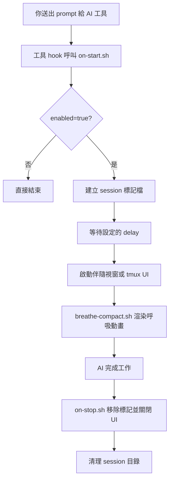

<p align="center">
  
</p>

<p align="center">
  <a href="../README.md">English</a> | <b>繁體中文</b> | <a href="README.zh-CN.md">简体中文</a> | <a href="README.ja.md">日本語</a>
</p>

<p align="center">
  
  
  
</p>

---

每次你送出 prompt 給 AI 編程助手，都會有 10–60 秒以上的等待時間。**HushFlow** 把這段空白變成引導式呼吸練習 —— AI 開始工作時自動啟動，完成時自動關閉。

**將 AI 的等待時間，轉化為片刻的正念寧靜。** 🧘‍♂️

支援 **Claude Code**、**Gemini CLI** 和 **Codex CLI**。可在 **macOS**、**Linux** 和 **Windows** 上運行。

## ⚡ 一眼看懂

<table>
  <tr>
    <td align="center" width="25%">
      <strong>🫁 引導呼吸</strong><br />
      4 種節奏：諧振、生理嘆息、箱式與 4-7-8。
    </td>
    <td align="center" width="25%">
      <strong>🔌 自動 Hook</strong><br />
      AI 一開始工作就啟動，結束就自動收掉。
    </td>
    <td align="center" width="25%">
      <strong>🖥️ 彈性 UI</strong><br />
      可用伴隨視窗、tmux pane、popup 或 inline。
    </td>
    <td align="center" width="25%">
      <strong>🎨 專業視覺</strong><br />
      6 種次像素動畫，搭配 5 級色彩漸層。
    </td>
  </tr>
</table>

## 📺 DEMO

<p align="center">
  
</p>

## ✨ 功能特色

- 🧘 **4 種呼吸練習** — 諧振呼吸、生理嘆息、箱式呼吸、4-7-8 呼吸
- 🎭 **6 種動畫風格** — 星座、漣漪、波浪、軌道、螺旋、落雨
- 🌈 **8+ 色彩主題** — 海洋青、暮光紫、琥珀暖 + 社群主題（Catppuccin、Dracula、Nord、Solarized、Gruvbox）
- 📊 **使用統計** — 追蹤呼吸次數、正念時間、連續天數，執行 `hushflow stats` 查看
- 🔄 **通用指令包裝** — `hushflow wrap -- <任何指令>` 讓任何等待都有呼吸陪伴
- 🔔 **音效整合** — 可選的呼吸轉換提示音
- 🚀 **不干擾工作** — 於獨立視窗運行；對 AI 工具的輸出零影響。
- 📉 **專業渲染** — 高效能 Bash 引擎，使用 SIN64 查找表實現 10fps 無閃爍動畫。
- 🔌 **外掛支援 (Plugin API)** — 支援透過 `~/.hushflow/plugins/` 自定義動畫。
- 🤖 **自動啟動 / 自動關閉** — 可設定延遲啟動，AI 完成後自動消失。
- 💻 **跨平台** — Ghostty、Terminal.app、iTerm2、GNOME Terminal、xterm、Windows Terminal。

## 🚀 快速開始

### 📦 推薦：一行安裝

```bash
curl -fsSL https://raw.githubusercontent.com/cry8a8y/HushFlow/main/install-remote.sh | sh
```

### 🛠️ 使用 npx

```bash
npx hushflow install
```

### 📖 手動安裝

```bash
git clone https://github.com/cry8a8y/HushFlow.git
cd HushFlow
./install.sh
```

> [!NOTE]
> 需要安裝 `jq` 以管理 JSON 設定檔。

### 🪟 Windows

```powershell
git clone https://github.com/cry8a8y/HushFlow.git
cd HushFlow
.\install.ps1
```

## 🧠 運作原理



## 🛠️ 支援的 AI 工具

| 工具 | 🟢 啟動 Hook | 🔴 停止 Hook | 狀態 |
|------|----------|----------|------|
| **Claude Code** | `UserPromptSubmit` | `Stop` | ✅ 完整支援 |
| **Gemini CLI** | `BeforeAgent` | `AfterAgent` | ✅ 完整支援 |
| **Codex CLI** | `SessionStart` | `Stop` | ⏳ Session 層級 |

指定安裝特定工具：

```bash
hushflow install --target gemini
```

## ⚙️ 設定

設定檔位於各工具目錄下 `~/.<tool>/hushflow/config`：

```ini
enabled=true
exercise=0
delay=5
theme=teal
animation=constellation
sound=false
```

### ⌨️ CLI 指令

```bash
# 設定呼吸練習
hushflow config hrv            # 諧振呼吸
hushflow config sigh           # 生理嘆息
hushflow config box            # 箱式呼吸
hushflow config 478            # 4-7-8 呼吸

# 設定主題
hushflow theme twilight        # 暮光紫
hushflow theme catppuccin-mocha # 社群主題
hushflow theme list            # 列出所有可用主題

# 設定動畫
hushflow animation orbit       # 雙彗星軌道

# 音效
hushflow sound on              # 啟用呼吸轉換提示音
hushflow sound off             # 關閉音效

# 統計
hushflow stats                 # 查看使用統計與連續天數

# 通用包裝
hushflow wrap -- npm install   # 任何指令執行時都能呼吸

# 診斷工具
hushflow doctor                # 檢查安裝狀態與環境
```

> [!TIP]
> 在 Claude Code 中，也可以使用 `/hushflow` 指令進行互動式設定。

## 🛠️ 進階自定義

### 🧩 外掛 API (實驗性)

將自定義動畫腳本放置於 `~/.hushflow/plugins/`。每個外掛定義一個 `render_<name>()` 函數，將 ANSI 轉義碼附加至 `$frame` 變數中。

```bash
# 安裝範例外掛
mkdir -p ~/.hushflow/plugins
cp plugins/example-pulse.sh ~/.hushflow/plugins/pulse.sh
hushflow animation pulse
```

詳見 [Plugin API 文件](PLUGIN-API.md)，包含可用變數、三角函數表、色彩設定與效能建議。

### 🌐 環境變數

| 變數 | 預設值 | 說明 |
|------|--------|------|
| `HUSHFLOW_UI_MODE` | `window` | `window`、`tmux-pane`、`tmux-popup`、`inline` 或 `off` |
| `HUSHFLOW_DELAY_SECONDS` | 設定檔中的 `delay` | 覆寫啟動延遲時間 |
| `HUSHFLOW_COLS` | 自動偵測 | 覆寫終端寬度（欄數） |
| `HUSHFLOW_ROWS` | 自動偵測 | 覆寫終端高度（列數） |
| `HUSHFLOW_TERMINAL` | 自動偵測 | 強制指定終端類型（如 `ghostty`、`iterm`、`xterm`） |
| `HUSHFLOW_PLUGIN_DIR` | `~/.hushflow/plugins` | 自定義外掛目錄 |
| `HUSHFLOW_DEBUG` | 關閉 | 設為 `1` 啟用除錯日誌，輸出至 `/tmp/hushflow-debug.log` |

## 🔍 疑難排解

如果動畫未如預期出現，請執行內建的診斷工具：

```bash
hushflow doctor
```

## 🗑️ 解除安裝

```bash
hushflow uninstall
```

## 💖 致謝

HushFlow 衍生自 [Mindful-Claude](https://github.com/halluton/Mindful-Claude)（作者：Halluton），基於 MIT 授權。詳見 [THIRD-PARTY-NOTICES](../THIRD-PARTY-NOTICES)。

## 📄 授權

MIT。詳見 [LICENSE](../LICENSE)。
